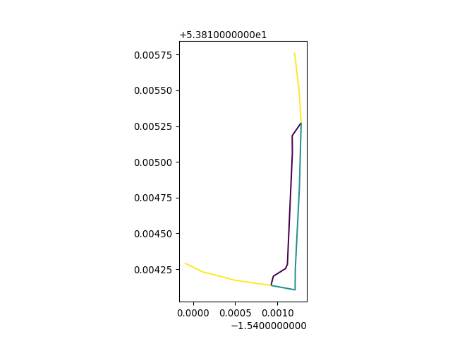
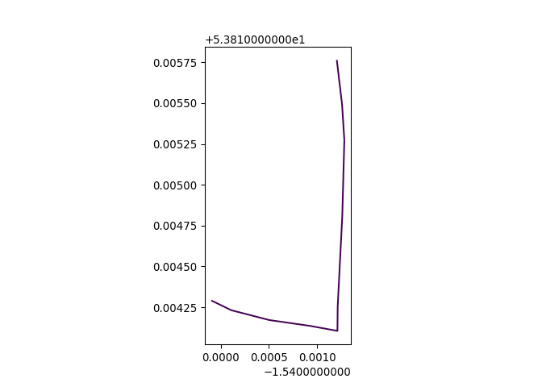

# networkmerge

A minimal example dataset was created with the ATIP tool. The example
dataset can be found in the `data` folder.

To read-in the data into Python we used the following:

``` python
import matplotlib.pyplot as plt
import pandas as pd
import math
from typing import List, Tuple
from shapely.geometry import LineString
import geopandas as gpd
import osmnx as ox

network = gpd.read_file("data/minimal-input.geojson")
# Column names:
network.columns
output = gpd.read_file("data/minimal-output.geojson")
network.plot(column='value')
plt.show()
output.plot(column='value')
plt.show()

```

    Index(['value', 'geometry'], dtype='object')

``` python
# colour is based on 'description' column
output = gpd.read_file("data/minimal-output.geojson")
network.plot(column='value')
plt.show()
```



``` python
output.plot(column='value')
plt.show()
```


