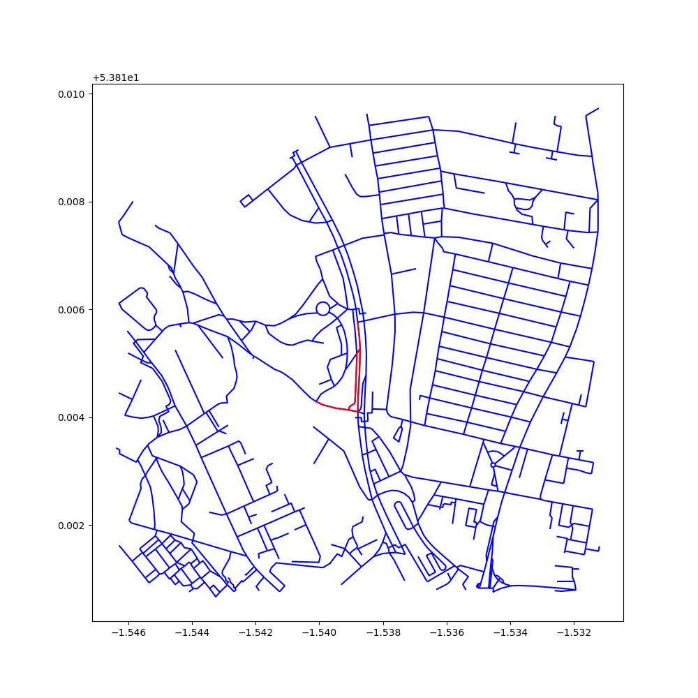
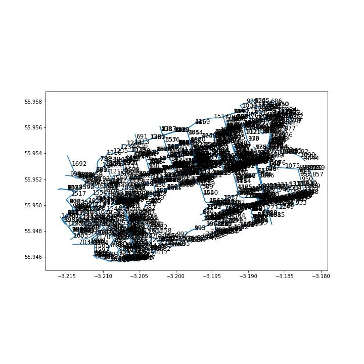
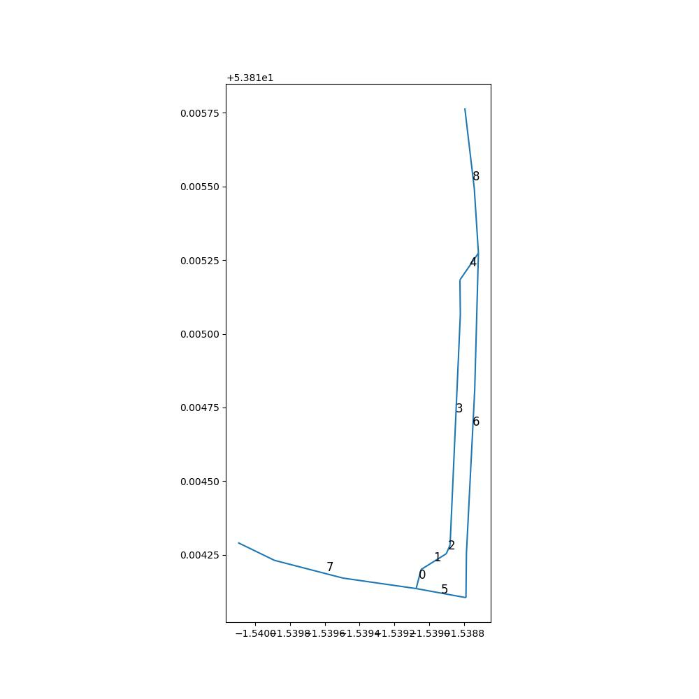
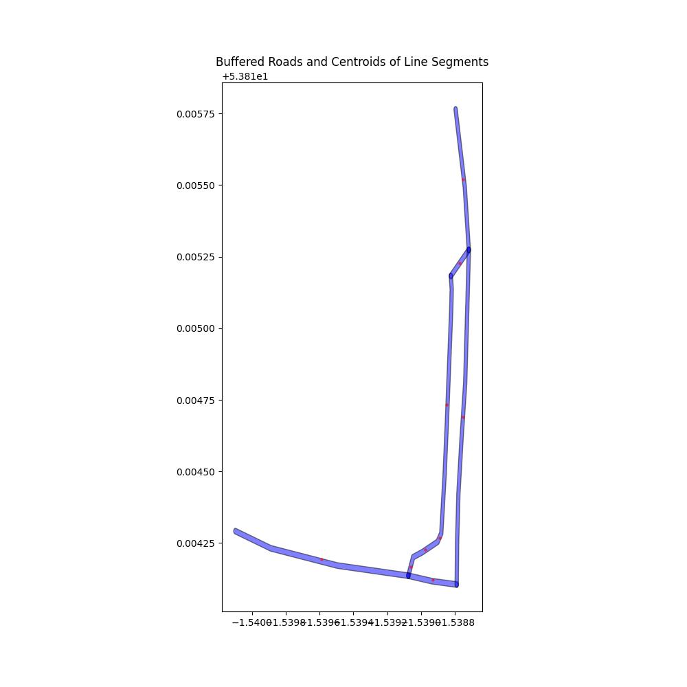
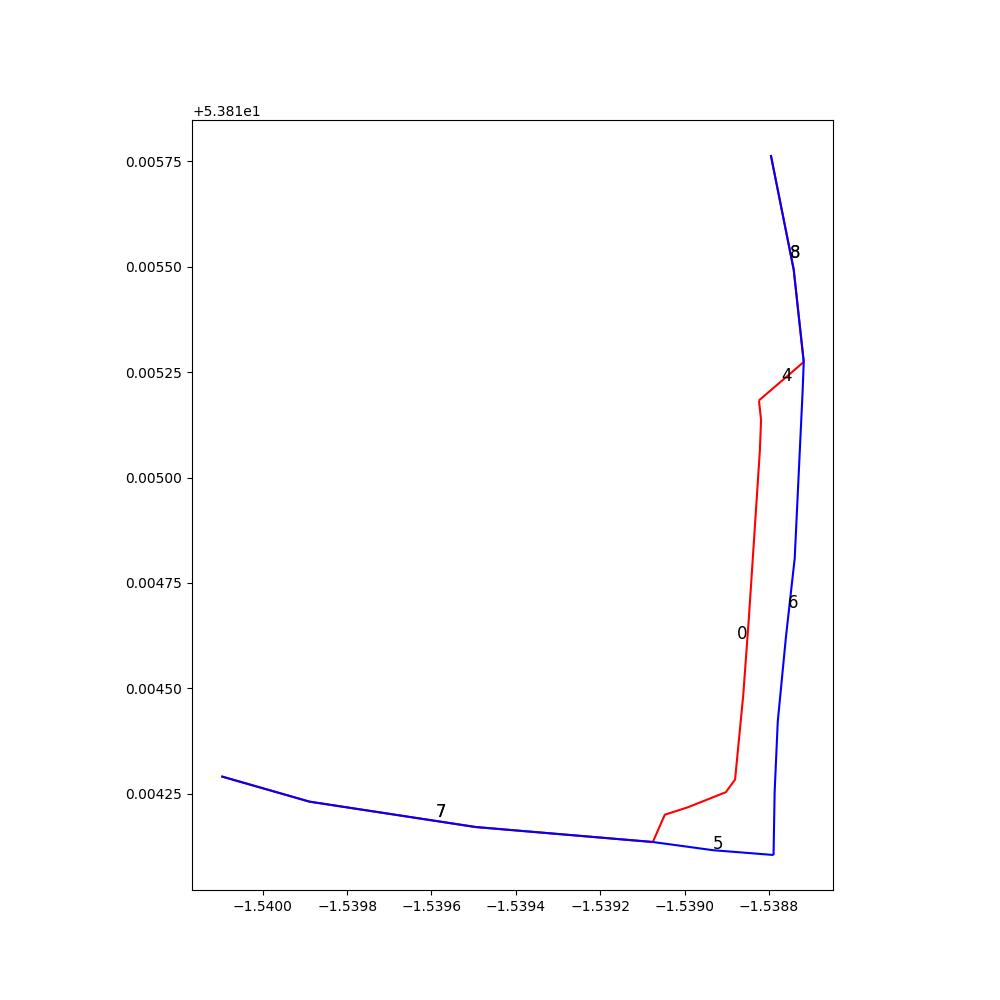
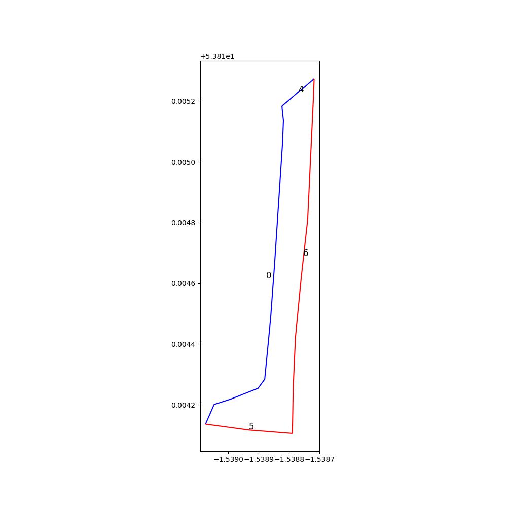
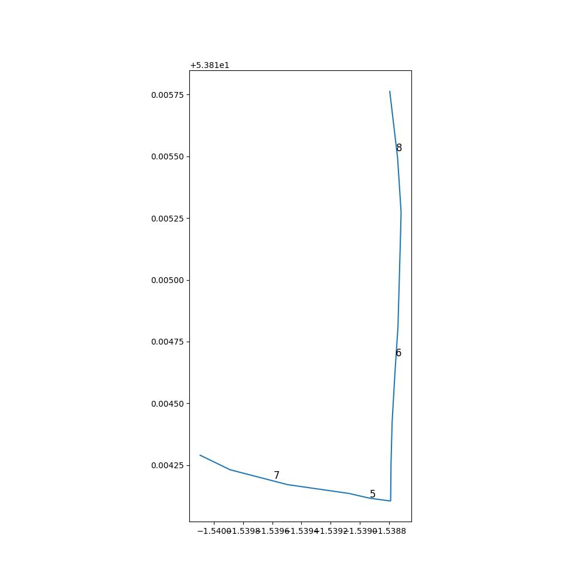

# networkmerge

A minimal example dataset was created with the ATIP tool. The example
dataset can be found in the `data` folder.

To read-in the data into Python we used the following:

``` python
import matplotlib.pyplot as plt
import pandas as pd
import math
from typing import List, Tuple
from shapely.geometry import LineString
import geopandas as gpd
import osmnx as ox
import numpy as np
from scipy.spatial.distance import pdist, squareform
from shapely.geometry import Point
import networkx as nx
network = gpd.read_file("data/minimal-input.geojson")
# Column names:
network.columns
output = gpd.read_file("data/minimal-output.geojson")

fig, ax = plt.subplots(figsize=(10, 10))
network.plot(ax =ax, color = 'red' , column='value')
output.plot(ax =ax,  color = 'blue' ,column='value')
plt.savefig("pics/network_output.jpg")
plt.show()
```


``` python
# Download Leeds Road Network data from OSM
# Define the point and distance
point = (53.81524, -1.53880)
distance = 500  # in meters

#########################################################################
#############function to plot GeoDataFrame with index label##############
#########################################################################
def plot_geodataframe_with_labels(gdf, gdf_name):

    # Create a new figure
    fig, ax = plt.subplots(figsize=(10, 10))

    # Plot the GeoDataFrame
    gdf.plot(ax=ax)

    # Add labels for each line with its index
    for x, y, label in zip(gdf.geometry.centroid.x, gdf.geometry.centroid.y, gdf.index):
        ax.text(x, y, str(label), fontsize=12)
    plt.savefig(f"pics/{gdf_name}.jpg")
    # Display the plot
    plt.show()

#########################################################################
##### Download the road network data for the area around the point ######
#########################################################################
graph = ox.graph_from_point(point, dist=distance, network_type='all')

# Save the road network as a shapefile
ox.save_graph_shapefile(graph, filepath=r'data/')

gdf = gpd.read_file("data/minimal-input.geojson")
gdf_road = gpd.read_file("data/edges.shp")

# Create the plot
fig, ax = plt.subplots(figsize=(10, 10))

# Plot the Shapefile data
gdf_road.plot(ax=ax, color='blue')

# Plot the GeoJSON data
gdf.plot(ax=ax, color='red')

plt.savefig(f"pics/gdf_road.jpg")
plt.show()

```


``` python
#########################################################################
############### Find matching lines from Leeds road data ################
#########################################################################

# Define the buffer size
buffer_size = 0.00001

# Create a buffer around the geometries in gdf
gdf_buffered = gdf.copy()
gdf_buffered.geometry = gdf.geometry.buffer(buffer_size)

# Initialize an empty DataFrame to store the matching lines
matching_lines_large_intersection = gpd.GeoDataFrame(columns=gdf_road.columns)

# Define the intersection length threshold
intersection_length_threshold = 0.0001

# Iterate over the buffered geometries in the GeoJSON GeoDataFrame
for geojson_line in gdf_buffered.geometry:
    # Iterate over the geometries in the shapefile GeoDataFrame
    for _, edge_row in gdf_road.iterrows():
        shapefile_line = edge_row.geometry
        
        # Calculate the intersection of the GeoJSON line and the shapefile line
        intersection = geojson_line.intersection(shapefile_line)
        
        # If the length of the intersection exceeds the threshold, add the shapefile line to the matching lines DataFrame
        if intersection.length > intersection_length_threshold:
            matching_lines_large_intersection = pd.concat([matching_lines_large_intersection, pd.DataFrame(edge_row).T])

# Plot gdf_buffered (in blue) and matching_lines_buffered (in green) on the same plot
fig, ax = plt.subplots(figsize=(10, 10))

gdf_buffered.boundary.plot(ax=ax, color='blue', label='minimal-input.geojson (Buffered)')
matching_lines_large_intersection.plot(ax=ax, color='green', label='matching_lines_buffered')
gdf.plot(ax=ax, color='black')
ax.set_title('Comparison of minimal-input.geojson (Buffered) and matching_lines_buffered')
ax.legend()
plt.savefig(f"pics/matching_lines.jpg")
plt.show()
matching_lines_large_intersection.to_file("data/gdf_matching_lines.geojson", driver='GeoJSON')
gdf_matching_lines = gpd.read_file("data/gdf_matching_lines.geojson")
plot_geodataframe_with_labels(gdf_matching_lines, gdf_name ='gdf_matching_lines')

```


``` python
#########################################################################
################### Function to split line by angle #####################
#########################################################################
def split_line_at_angles(line, value, threshold=30):
    if isinstance(line, LineString):
        coords = np.array(line.coords)
    elif isinstance(line, MultiLineString):
        coords = np.concatenate([np.array(geom.coords) for geom in line.geoms])
    else:
        raise ValueError(f"Unexpected geometry type: {type(line)}")

    # Compute the direction of each vector
    vectors = np.diff(coords, axis=0)
    directions = np.arctan2(vectors[:,1], vectors[:,0])

    # Compute the angle between each pair of vectors
    angles = np.diff(directions)
    
    # Convert the angles to degrees and take absolute values
    angles = np.abs(np.degrees(angles))

    # Identify the indices where the angle exceeds the threshold
    split_indices = np.where(angles > threshold)[0] + 1

    # Split the line at the points corresponding to the split indices
    segments = []
    last_index = 0
    for index in split_indices:
        segment = LineString(coords[last_index:index+1])
        segments.append((segment, value))
        last_index = index
    segment = LineString(coords[last_index:])
    segments.append((segment, value))

    return segments

# Apply the function to each line in the gdf with threshold=30
gdf_split_list = gdf.apply(lambda row: split_line_at_angles(row['geometry'], row['value'], threshold=30), axis=1)

# Convert the list of tuples into a DataFrame
gdf_split = pd.DataFrame([t for sublist in gdf_split_list for t in sublist], columns=['geometry', 'value'])

# Convert the DataFrame to a GeoDataFrame
gdf_split = gpd.GeoDataFrame(gdf_split, geometry='geometry')

# Set the CRS of gdf_split to match that of gdf
gdf_split.crs = gdf.crs

plot_geodataframe_with_labels(gdf_split, gdf_name ='gdf_split')

```


``` python
#########################################################################
### Find the nearest line in the .shp for a given line in the GeoJSON ###
#########################################################################
# Convert buffer size to degrees
buffer_size = 0.00001

# Create buffer around each road
gdf_matching_lines['buffer'] = gdf_matching_lines['geometry'].buffer(buffer_size)

# Compute centroids of lines in gdf_split
gdf_split['centroid'] = gdf_split['geometry'].centroid

# Create a new GeoDataFrame for buffers
gdf_buffer = gpd.GeoDataFrame(gdf_matching_lines, geometry='buffer')

# Set up the plot
fig, ax = plt.subplots(figsize=(10, 10))

# Plot buffers
gdf_buffer.plot(ax=ax, color='blue', alpha=0.5, edgecolor='k')

# Plot centroids
gdf_split['centroid'].plot(ax=ax, markersize=5, color='red', alpha=0.5, marker='o')

# Set plot title
ax.set_title('Buffered Roads and Centroids of Line Segments')
plt.savefig(f"pics/Buffered Roads and Centroids of Line Segments.jpg")
plt.show()

```


``` python
# Copy the columns from gdf_matching_lines to gdf_split
for col in gdf_matching_lines.columns:
    if col not in gdf_split.columns and col != 'value':
        gdf_split[col] = None

# Iterate over each row in gdf_split
for i, row in gdf_split.iterrows():
    # Check if the centroid of the line falls within any buffer in gdf_matching_lines
    for j, road in gdf_matching_lines.iterrows():
        if row['centroid'].within(road['buffer']):
            # If it does, copy the attributes from gdf_matching_lines to gdf_split
            for col in gdf_matching_lines.columns:
                if col != 'value':
                    gdf_split.at[i, col] = gdf_matching_lines.at[j, col]
            break

gdf_split = gdf_split[['value', 'name', 'highway','geometry']]
gdf_split.to_file("data/gdf_att.geojson", driver='GeoJSON')    
gdf_att = gpd.read_file("data/gdf_att.geojson")
gdf_att
#########################################################################
######### Find start and end point to define the flow direction #########
#########################################################################
gdf_att = gdf_att.set_crs("EPSG:4326")
gdf_split["start_point"] = gdf_split.geometry.apply(lambda line: line.coords[0])
gdf_split["end_point"] = gdf_split.geometry.apply(lambda line: line.coords[-1])

# Create a list of all start and end points
points = gdf_split["start_point"].tolist() + gdf_split["end_point"].tolist()

# Create a function to calculate the distance between two points
def calculate_distance(point1, point2):
    return Point(point1).distance(Point(point2))

# Calculate the pairwise distances between all points
distances = pdist(points, calculate_distance)

# Convert the distances to a square matrix
dist_matrix = squareform(distances)

# Find the indices of the two points that are farthest apart
farthest_points = np.unravel_index(dist_matrix.argmax(), dist_matrix.shape)

# Get the coordinates of the two points that are farthest apart
start_point = points[farthest_points[0]]
end_point = points[farthest_points[1]]
start_point, end_point

#########################################################################
############ Find all paths using start_point and end_point #############
#########################################################################

def generate_all_paths(G, start_point, end_point, max_paths=100):
    # Initialize a counter for the number of paths
    path_count = 0
    
    # Use DFS to generate all paths
    for path in nx.all_simple_paths(G, start_point, end_point):
        yield path
        
        # Increment the path counter
        path_count += 1
        
        # If we've generated the maximum number of paths, stop
        if path_count >= max_paths:
            return

# Create a new NetworkX graph
G = nx.Graph()

# Add each line in the GeoDataFrame as an edge in the graph
for i, row in gdf_split.iterrows():
    # We'll use the length of the line as the weight
    weight = row.geometry.length
    G.add_edge(row.start_point, row.end_point, weight=weight)

# Find the shortest path from the start point to the end point
try:
    shortest_path = nx.shortest_path(G, start_point, end_point, weight='weight')
except nx.NetworkXNoPath:
    shortest_path = None

shortest_path

# Create a list to store all paths
all_paths = []

# Generate all paths
for path in generate_all_paths(G, start_point, end_point):
    all_paths.append(path)

len(all_paths), all_paths

def find_line_by_points(gdf, start_point, end_point, tolerance=1e-6):
    # Convert the start and end points to Point objects
    start_point = Point(start_point)
    end_point = Point(end_point)

    # Iterate over the lines in the GeoDataFrame
    for _, line in gdf.iterrows():
        # If the start and end points of the line are within a small distance of the given start and end points, return the line
        if line.geometry.distance(start_point) < tolerance and line.geometry.distance(end_point) < tolerance:
            return line

    # If no line was found, return None
    return None

def plot_paths(gdf, paths, shortest_path,gdf_name):
    # Create a new figure
    fig, ax = plt.subplots(figsize=(10, 10))

    # Plot each path
    for i, path in enumerate(paths):
        for start_point, end_point in zip(path[:-1], path[1:]):
            # Find the line in the GeoDataFrame that corresponds to this edge
            line = find_line_by_points(gdf, start_point, end_point)
            
            # If this line is in the shortest path, plot it in red, otherwise plot it in blue
            color = 'red' if path == shortest_path else 'blue'
            
            # Plot the line
            gpd.GeoSeries(line.geometry).plot(ax=ax, color=color)
            
            # Add a label with the line's index
            x, y = line.geometry.centroid.x, line.geometry.centroid.y
            ax.text(x, y, str(line.name), fontsize=12)
    plt.savefig(f"pics/gdf_{gdf_name}.jpg")        
    # Display the plot
    plt.show()

# Use the function to plot the paths
plot_paths(gdf_split, all_paths, shortest_path,gdf_name ='all_paths')

```


``` python
#########################################################################
######################## Find division subpaths #########################
#########################################################################

def find_division_subpaths(gdf, paths):
    division_subpaths = []
    
    # Initialize a set with the waypoints in the first path
    common_waypoints = set(paths[0])
    
    # Iterate over the rest of the paths
    for path in paths[1:]:
        # Update the set of common waypoints to be the intersection of the current set of common waypoints and the waypoints in this path
        common_waypoints &= set(path)
    
    # Find the last common waypoint among the paths (the division waypoint)
    division_waypoint = None
    for waypoint in paths[0]:
        if waypoint in common_waypoints:
            division_waypoint = waypoint
        else:
            break
    
    for path in paths:
        # Initialize the division subpath for this path
        division_subpath = []
        
        # Find the index of the division waypoint in this path
        division_waypoint_index = path.index(division_waypoint)

        # Iterate over the waypoints in the path from the division waypoint to the end waypoint
        for start_point, end_point in zip(path[division_waypoint_index:], path[division_waypoint_index+1:]):
            # Find the line in the GeoDataFrame that corresponds to this edge
            line = find_line_by_points(gdf, start_point, end_point)
            
            # Add the index of the line to the division subpath
            division_subpath.append(line.name)
        
        # Add the division subpath to the list of division subpaths
        division_subpaths.append(division_subpath)
    
    # Initialize a set with the lines in the first division subpath
    common_lines = set(division_subpaths[0])
    
    # Iterate over the rest of the division subpaths
    for division_subpath in division_subpaths[1:]:
        # Update the set of common lines to be the intersection of the current set of common lines and the lines in this division subpath
        common_lines &= set(division_subpath)

    # Remove the common lines from each division subpath
    for division_subpath in division_subpaths:
        for line in common_lines:
            if line in division_subpath:
                division_subpath.remove(line)

    return division_subpaths

# Use the function to find the division subpaths
division_subpaths = find_division_subpaths(gdf_split, all_paths)
division_subpaths

def plot_lines_by_indices(gdf, line_indices_lists, colors, gdf_name):
    # Create a new figure
    fig, ax = plt.subplots(figsize=(10, 10))
    
    # Plot each line
    for line_indices, color in zip(line_indices_lists, colors):
        for line_index in line_indices:
            # Get the line from the GeoDataFrame
            line = gdf.loc[line_index]
            
            # Plot the line
            gpd.GeoSeries(line.geometry).plot(ax=ax, color=color)
            
            # Add a label with the line's index
            x, y = line.geometry.centroid.x, line.geometry.centroid.y
            ax.text(x, y, str(line.name), fontsize=12)
    plt.savefig(f"pics/gdf_{gdf_name}.jpg")  
    # Display the plot
    plt.show()

# Use the function to plot the division subpaths
plot_lines_by_indices(gdf_split, division_subpaths, ['blue', 'red'], gdf_name ='division_subpaths')

```


``` python
#########################################################################
################ Simplify the road network by road type #################
#########################################################################
def simplify_subpaths(gdf, subpaths, road_type ='footway'):
    # Create a copy of the GeoDataFrame to avoid modifying the original data
    gdf = gdf.copy()

    # Find the subpaths that should be removed
    removed_subpaths = [subpath for subpath in subpaths if all(gdf.loc[line_index, 'highway'] == 'footway' for line_index in subpath)]

    # Calculate the mean 'value' of the lines in the removed subpaths, if any
    mean_value = 0
    if removed_subpaths:
        # Exclude NaNs from mean calculation
        mean_value = np.nanmean([gdf.loc[line_index, 'value'] for subpath in removed_subpaths for line_index in subpath])

    # Remove the removed subpaths from the division subpaths
    for removed_subpath in removed_subpaths:
        subpaths.remove(removed_subpath)

    # Add the mean value to the 'value' of the lines in the remaining subpaths
    for subpath in subpaths:
        for line_index in subpath:
            if line_index in gdf.index:
                if np.isnan(gdf.loc[line_index, 'value']):
                    gdf.loc[line_index, 'value'] = mean_value
                else:
                    gdf.loc[line_index, 'value'] += mean_value

    # Remove the footway lines from the DataFrame
    gdf = gdf[gdf['highway'] != road_type]

    return subpaths, gdf

# Use the function to simplify the division subpaths
division_subpaths, gdf_split_modified = simplify_subpaths(gdf_split, division_subpaths, road_type ='footway')

# Show the modified GeoDataFrame
plot_geodataframe_with_labels(gdf_split_modified, gdf_name ='gdf_split_modified')

```



