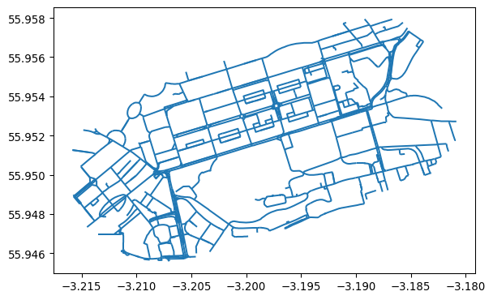
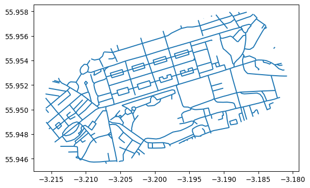

In Python these inputs are as follows:

``` python
import geopandas as gpd
input_simple = gpd.read_file("data/rnet_pinces_street_simple.geojson")
input_complex = gpd.read_file("data/rnet_princes_street.geojson")
```

Plot them as follows:

``` python
input_complex.plot()
```

    <AxesSubplot:>



``` python
input_simple.plot()
```

    <AxesSubplot:>


