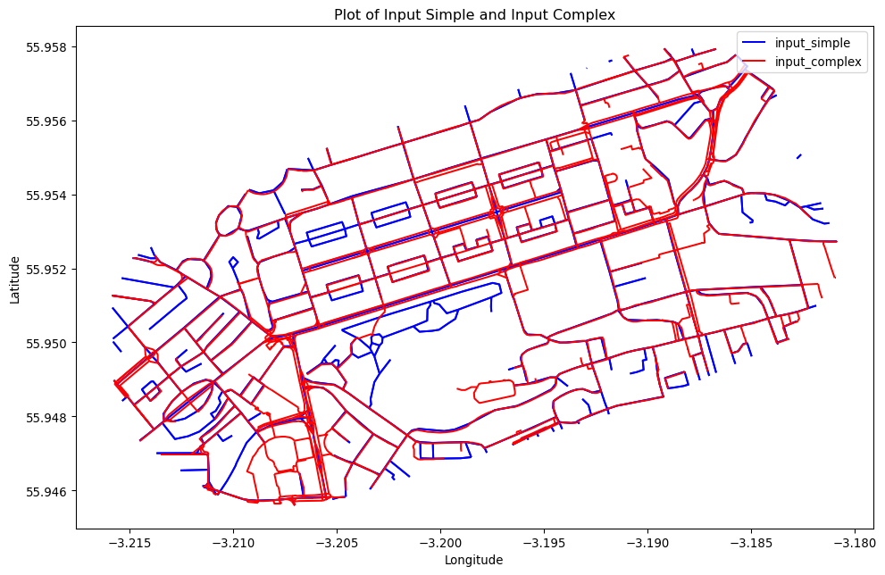

In Python these inputs are as follows:

``` python
import geopandas as gpd
input_simple = gpd.read_file("data/rnet_pinces_street_simple.geojson")
input_complex = gpd.read_file("data/rnet_princes_street.geojson")
```

Plot them as follows:

``` python
import geopandas as gpd
import matplotlib.pyplot as plt

# Plotting both files
fig, ax = plt.subplots(figsize=(12, 8))
input_simple.plot(ax=ax, color='blue', label='input_simple')
input_complex.plot(ax=ax, color='red', label='input_complex')
plt.legend()
plt.title('Plot of Input Simple and Input Complex')
plt.xlabel('Longitude')
plt.ylabel('Latitude')
plt.show()
```



``` python
input_complex.head()

input_simple_with_attributes = gpd.sjoin(input_simple, input_complex, how="left", op="intersects")

# Plotting the updated input_simple layer
fig, ax = plt.subplots(figsize=(12, 8))
input_simple_with_attributes.plot(ax=ax, cmap='viridis', legend=True)
plt.title('Plot of Input Simple with Attributes from Input Complex')
plt.xlabel('Longitude')
plt.ylabel('Latitude')
plt.show()

# Checking the first few rows to confirm that the attributes have been transferred
input_simple_with_attributes.head()
```
