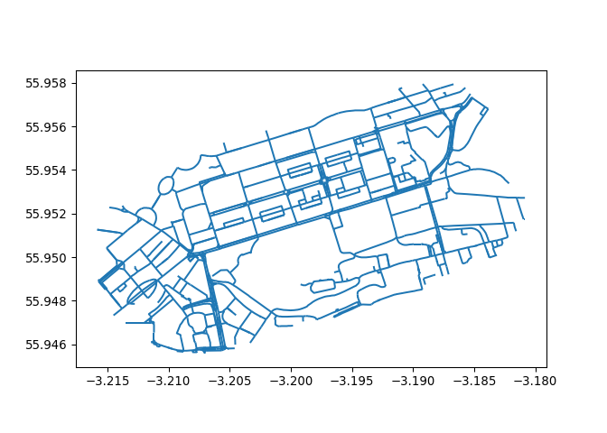
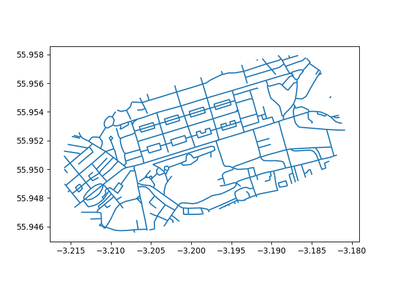

# Prerequisites

..

``` r
library(tidyverse)
```

    ── Attaching core tidyverse packages ──────────────────────── tidyverse 2.0.0 ──
    ✔ dplyr     1.1.2     ✔ readr     2.1.4
    ✔ forcats   1.0.0     ✔ stringr   1.5.0
    ✔ ggplot2   3.4.2     ✔ tibble    3.2.1
    ✔ lubridate 1.9.2     ✔ tidyr     1.3.0
    ✔ purrr     1.0.1     
    ── Conflicts ────────────────────────────────────────── tidyverse_conflicts() ──
    ✖ dplyr::filter() masks stats::filter()
    ✖ dplyr::lag()    masks stats::lag()
    ℹ Use the conflicted package (<http://conflicted.r-lib.org/>) to force all conflicts to become errors

``` r
library(sf)
```

    Linking to GEOS 3.11.1, GDAL 3.6.4, PROJ 9.1.1; sf_use_s2() is TRUE

``` r
library(tmap)
```

    The legacy packages maptools, rgdal, and rgeos, underpinning the sp package,
    which was just loaded, will retire in October 2023.
    Please refer to R-spatial evolution reports for details, especially
    https://r-spatial.org/r/2023/05/15/evolution4.html.
    It may be desirable to make the sf package available;
    package maintainers should consider adding sf to Suggests:.
    The sp package is now running under evolution status 2
         (status 2 uses the sf package in place of rgdal)

``` r
input_complex = sf::read_sf("data/rnet_princes_street.geojson")
# input_simple = sf::read_sf("data/Edc_Roadlink.geojson")
# input_complex_union = sf::st_union(input_complex)
# input_complex_30m_buffer = sf::st_buffer(input_complex_union, 30)
# input_complex_convex_hull = sf::st_convex_hull(input_complex_union)
# input_simple = sf::st_intersection(input_simple, input_complex_convex_hull)
# sf::write_sf(input_simple, "data/rnet_pinces_street_simple.geojson")
# names(input_complex)[1] = "value"
# sf::write_sf(input_complex, "data/rnet_princes_street.geojson", delete_dsn = TRUE)
input_simple = sf::read_sf("data/rnet_pinces_street_simple.geojson")
```

``` r
m1 = qtm(input_complex)
m2 = qtm(input_simple)
tmap_arrange(m1, m2, nrow = 1)
```


``` r
remotes::install_github("ropensci/stplanr")
```

    Using github PAT from envvar GITHUB_PAT

    Skipping install of 'stplanr' from a github remote, the SHA1 (bdbdd983) has not changed since last install.
      Use `force = TRUE` to force installation

``` r
# stplanr::rnet_join
```

The values in the `input_complex` dataset are as follows:

``` r
names(input_complex)
```

    [1] "value"     "Quietness" "length"    "index"     "geometry" 

``` r
summary(input_complex$value)
```

       Min. 1st Qu.  Median    Mean 3rd Qu.    Max. 
        0.0     3.0    88.0   328.4   375.2  3212.0 

In Python these inputs are as follows:

``` python
import geopandas as gpd
input_simple = gpd.read_file("data/rnet_pinces_street_simple.geojson")
input_complex = gpd.read_file("data/rnet_princes_street.geojson")
```

Plot them as follows:

``` python
input_complex.plot()
```



``` python
input_simple.plot()
```


