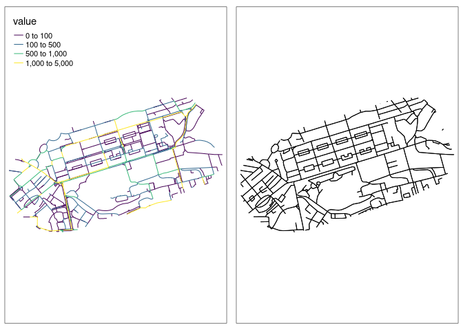
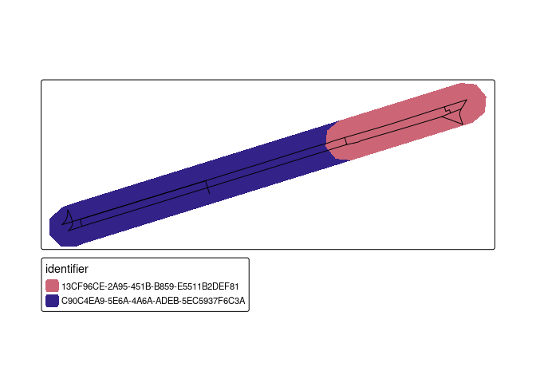

# Prerequisites

The following example requires R and the following packages:

``` r
library(tidyverse)
library(sf)
library(tmap)
```

# Input data

The inputs are as follows:

``` r
input_complex = sf::read_sf("data/rnet_princes_street.geojson")
input_simple = sf::read_sf("data/rnet_pinces_street_simple.geojson")
```

``` r
brks = c(0, 100, 500, 1000, 5000)
m1 = tm_shape(input_complex) + tm_lines("value", palette = "viridis", breaks = brks)
m2 = tm_shape(input_simple) + tm_lines()
tmap_arrange(m1, m2, nrow = 1)
```



# Joining the data

``` r
remotes::install_github("ropensci/stplanr")
```

    Using github PAT from envvar GITHUB_PAT

    Skipping install of 'stplanr' from a github remote, the SHA1 (bdbdd983) has not changed since last install.
      Use `force = TRUE` to force installation

``` r
# stplanr::rnet_join
```

The values in the `input_complex` dataset are as follows:

``` r
names(input_complex)
```

    [1] "value"     "Quietness" "length"    "index"     "geometry" 

``` r
summary(input_complex$value)
```

       Min. 1st Qu.  Median    Mean 3rd Qu.    Max. 
        0.0     3.0    88.0   328.4   375.2  3212.0 

To join the network values we will try the `rnet_join` function in
`stplanr`, which has the following arguments:

``` r
args(stplanr::rnet_join)
```

    function (rnet_x, rnet_y, dist = 5, length_y = TRUE, key_column = 1, 
        subset_x = TRUE, dist_subset = 5, split_y = TRUE, ...) 
    NULL

``` r
input_simple_id = input_simple |>
  select(identifier)
rnet_joined = stplanr::rnet_join(input_simple_id, input_complex, dist = 30)
```

    Warning: attribute variables are assumed to be spatially constant throughout
    all geometries

    Warning in st_cast.sf(sf::st_cast(x, "MULTILINESTRING"), "LINESTRING"):
    repeating attributes for all sub-geometries for which they may not be constant

    Warning: attribute variables are assumed to be spatially constant throughout
    all geometries

    Warning in st_cast.sf(sf::st_cast(x, "MULTILINESTRING"), "LINESTRING"):
    repeating attributes for all sub-geometries for which they may not be constant

``` r
rnet_joined
```

    Simple feature collection with 2618 features and 7 fields
    Geometry type: POLYGON
    Dimension:     XY
    Bounding box:  xmin: -3.216283 ymin: 55.94534 xmax: -3.180377 ymax: 55.95821
    Geodetic CRS:  WGS 84
    # A tibble: 2,618 × 8
       identifier                              geometry value Quietness length index
     * <chr>                              <POLYGON [°]> <dbl>     <dbl>  <dbl> <int>
     1 93FE6E2B-7E51-4D3D-82… ((-3.182028 55.95153, -3…   333        90   72.8   829
     2 580841F5-EA4A-44E5-8E… ((-3.180399 55.95281, -3…    NA        NA   NA      NA
     3 E476FD90-AAF5-4779-AB… ((-3.180796 55.95246, -3…    NA        NA   NA      NA
     4 5C9AC265-0B3C-4176-95… ((-3.183044 55.95304, -3…     3        80   40.6   304
     5 5C9AC265-0B3C-4176-95… ((-3.183044 55.95304, -3…    31        60   10.0   395
     6 5C9AC265-0B3C-4176-95… ((-3.183044 55.95304, -3…    40        80  103.    440
     7 8E06C42A-AB3E-49E5-B6… ((-3.182967 55.95345, -3…   108        40  222.    603
     8 01C917BA-9BD2-4502-A4… ((-3.185653 55.95011, -3…    95        80   74.9   590
     9 01C917BA-9BD2-4502-A4… ((-3.185653 55.95011, -3…   211        60   20.2   746
    10 F90031B2-58A3-4B2C-95… ((-3.18592 55.94999, -3.…     3        60   37.4   238
    # ℹ 2,608 more rows
    # ℹ 2 more variables: length_osm_cast <dbl>, length_y <dbl>

``` r
nrow(rnet_joined)
```

    [1] 2618

``` r
nrow(input_simple)
```

    [1] 487

``` r
names(rnet_joined)
```

    [1] "identifier"      "geometry"        "value"           "Quietness"      
    [5] "length"          "index"           "length_osm_cast" "length_y"       

The overlapping network values are as follows:

``` r
tm_shape(rnet_joined) + tm_fill("value")
```


We can calculate the distance-weighted average of the network values as
follows:

``` r
rnetj_summary = rnet_joined %>%
  sf::st_drop_geometry() %>%
  group_by_at(1) %>%
    summarise(
      mean_flow = weighted.mean(value, length_y, na.rm = TRUE),
      total_flow_m = sum(value * length_y, na.rm = TRUE)
      )
input_simple_joined = left_join(input_simple, rnetj_summary)
```

    Joining with `by = join_by(identifier)`

``` r
input_simple_joined = input_simple_joined |>
  mutate(value = total_flow_m / length)
```

The initial result is as follows:

``` r
# sanity check lengths:
# cor(input_complex$length, sf::st_length(input_complex)) # 100%
total_flow_input = round(sum(input_complex$value * input_complex$length) / 1000)
# output:
total_flow_output = round(sum(input_simple_joined$value * as.numeric(sf::st_length((input_simple_joined))), na.rm = TRUE) / 1000)

message("Total flow input: ", total_flow_input, "km")
```

    Total flow input: 17164km

``` r
message("Total flow output: ", total_flow_output, "km")
```

    Total flow output: 19888km

``` r
summary(input_simple_joined$flow)
```

    Warning: Unknown or uninitialised column: `flow`.

    Length  Class   Mode 
         0   NULL   NULL 

``` r
m1 = tm_shape(input_complex) + tm_lines("value", palette = "viridis", lwd = 5, breaks = brks)
m2 = tm_shape(input_simple_joined) + tm_lines("value", palette = "viridis", lwd = 5, breaks = brks)
tmap_arrange(m1, m2, nrow = 1)
```

    Warning: Values have found that are higher than the highest break


We can adjust the values of the new network so that the total distance
travelled is the same:

``` r
over_estimate = total_flow_output / total_flow_input
input_simple_joined = input_simple_joined |>
  mutate(value = value / over_estimate)
```

The updated result is as follows:

``` r
total_flow_output = round(sum(input_simple_joined$value * as.numeric(sf::st_length((input_simple_joined))), na.rm = TRUE) / 1000)
message("Total flow input: ", total_flow_input, "km")
```

    Total flow input: 17164km

``` r
message("Total flow output: ", total_flow_output, "km")
```

    Total flow output: 17164km

We can explore the results interactively as follows:

``` r
tmap_mode("view")
m_combined = m1 + m2
tmap_save(m_combined, "data/m_combined.html")
browseURL("data/m_combined.html")
```

# Explanation

To clarify what’s going on, lets do the process only for a couple of
lines, and break the process down into steps.

``` r
input_simple_minimal = input_simple |>
  filter(identifier == "13CF96CE-2A95-451B-B859-E5511B2DEF81" | identifier == "C90C4EA9-5E6A-4A6A-ADEB-5EC5937F6C3A") 
```

The `rnet_join()` function as of July 2023 is as follows:

``` r
rnet_join = function(rnet_x, rnet_y, dist = 5, length_y = TRUE, key_column = 1,
                     subset_x = TRUE, dist_subset = 5, split_y = TRUE, ...) {
  if (subset_x) {
    rnet_x = rnet_subset(rnet_x, rnet_y, dist = dist_subset, ...)
  }
  rnet_x_buffer = geo_buffer(rnet_x, dist = dist, nQuadSegs = 2)
  if (split_y) {
    rnet_y = rnet_split_lines(rnet_y, rnet_x, dist = dist_subset)
  }
  if (length_y) {
    rnet_y$length_y = as.numeric(sf::st_length(rnet_y))
  }
  rnetj = sf::st_join(rnet_x_buffer[key_column], rnet_y, join = sf::st_contains)
  rnetj
}

rnet_subset = function(rnet_x, rnet_y, dist = 1, crop = TRUE, min_x = 3) {
  rnet_x$length_x_original = as.numeric(sf::st_length(rnet_x))
  rnet_y_union = sf::st_union(rnet_y)
  rnet_y_buffer = stplanr::geo_buffer(rnet_y_union, dist = dist, nQuadSegs = 2)
  if(crop) {
    rnet_x = sf::st_intersection(rnet_x, rnet_y_buffer)
    rnet_x = line_cast(rnet_x)
    rnet_x$length_x_cropped = as.numeric(sf::st_length(rnet_x))
    min_length = dist * min_x
    sel_short = rnet_x$length_x_cropped < min_length &
      rnet_x$length_x_original > min_length
    rnet_x = rnet_x[!sel_short, ]
  } else {
    rnet_x[rnet_y_buffer, , op = sf::st_within]
  }
  rnet_x
}
rnet_split_lines = function(rnet_x, geo_y, dist = 1) {
  if (all(grepl(pattern = "LINE", x = sf::st_geometry_type(rnet_x)))) {
    geo_y = c(
      lwgeom::st_startpoint(geo_y),
      lwgeom::st_endpoint(geo_y)
    )
  }
  # speed-up subsequent steps:
  points = sf::st_union(geo_y)
  points_buffer = stplanr::geo_buffer(points, dist = dist)
  rnet_split = sf::st_difference(rnet_x, points_buffer)
  rnet_split_lines = line_cast(rnet_split)
  rnet_split_lines$length_osm_cast = as.numeric(sf::st_length(rnet_split_lines))
  # rnet_split_lines[rnet_split_lines$length_osm_cast > min_lenth, ]
  rnet_split_lines
}
line_cast = function(x) {
  sf::st_cast(sf::st_cast(x, "MULTILINESTRING"), "LINESTRING")
}
```

Let’s run these lines line-by-line, starting by creating `rnet_x` and
`rnet_y` objects:

``` r
library(stplanr)
```


    Attaching package: 'stplanr'

    The following objects are masked _by_ '.GlobalEnv':

        line_cast, rnet_join, rnet_split_lines, rnet_subset

``` r
dist = 30
rnet_x = input_simple_minimal
rnet_x_buffer = geo_buffer(rnet_x, dist = dist, nQuadSegs = 2)
rnet_y = input_complex[rnet_x_buffer, , op = sf::st_within]
tm_shape(rnet_x_buffer) + tm_fill("identifier") + tm_shape(rnet_y) + tm_lines()
```

    Some legend labels were too wide. These labels have been resized to 0.66. Increase legend.width (argument of tm_layout) to make the legend wider and therefore the labels larger.



``` r
m = tm_shape(input_simple_minimal) + tm_lines(lwd = 5) +
  qtm(input_simple)
tmap_save(m, "maps/m_explanation.html")
```

    Interactive map saved to maps/m_explanation.html

``` r
# browseURL("maps/m_explanation.html")
```
