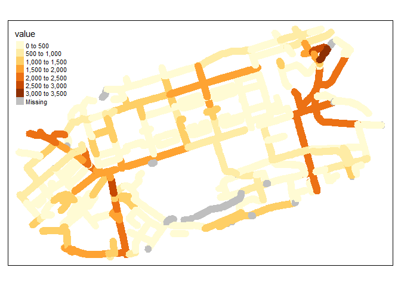
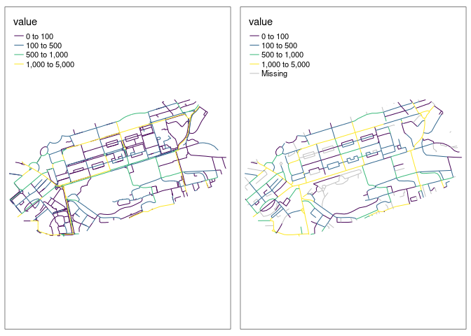

# Prerequisites

..

``` r
library(tidyverse)
```

    ── Attaching core tidyverse packages ──────────────────────── tidyverse 2.0.0 ──
    ✔ dplyr     1.1.2     ✔ readr     2.1.4
    ✔ forcats   1.0.0     ✔ stringr   1.5.0
    ✔ ggplot2   3.4.2     ✔ tibble    3.2.1
    ✔ lubridate 1.9.2     ✔ tidyr     1.3.0
    ✔ purrr     1.0.1     
    ── Conflicts ────────────────────────────────────────── tidyverse_conflicts() ──
    ✖ dplyr::filter() masks stats::filter()
    ✖ dplyr::lag()    masks stats::lag()
    ℹ Use the conflicted package (<http://conflicted.r-lib.org/>) to force all conflicts to become errors

``` r
library(sf)
```

    Linking to GEOS 3.11.2, GDAL 3.6.2, PROJ 9.2.0; sf_use_s2() is TRUE

``` r
library(tmap)
```

    The legacy packages maptools, rgdal, and rgeos, underpinning the sp package,
    which was just loaded, will retire in October 2023.
    Please refer to R-spatial evolution reports for details, especially
    https://r-spatial.org/r/2023/05/15/evolution4.html.
    It may be desirable to make the sf package available;
    package maintainers should consider adding sf to Suggests:.
    The sp package is now running under evolution status 2
         (status 2 uses the sf package in place of rgdal)

``` r
input_complex = sf::read_sf("data/rnet_princes_street.geojson")
# input_simple = sf::read_sf("data/Edc_Roadlink.geojson")
# input_complex_union = sf::st_union(input_complex)
# input_complex_30m_buffer = sf::st_buffer(input_complex_union, 30)
# input_complex_convex_hull = sf::st_convex_hull(input_complex_union)
# input_simple = sf::st_intersection(input_simple, input_complex_convex_hull)
# sf::write_sf(input_simple, "data/rnet_pinces_street_simple.geojson")
# names(input_complex)[1] = "value"
# sf::write_sf(input_complex, "data/rnet_princes_street.geojson", delete_dsn = TRUE)
input_simple = sf::read_sf("data/rnet_pinces_street_simple.geojson")
```

``` r
m1 = qtm(input_complex)
m2 = qtm(input_simple)
tmap_arrange(m1, m2, nrow = 1)
```


``` r
remotes::install_github("ropensci/stplanr")
```

    Skipping install of 'stplanr' from a github remote, the SHA1 (bdbdd983) has not changed since last install.
      Use `force = TRUE` to force installation

``` r
# stplanr::rnet_join
```

The values in the `input_complex` dataset are as follows:

``` r
names(input_complex)
```

    [1] "value"     "Quietness" "length"    "index"     "geometry" 

``` r
summary(input_complex$value)
```

       Min. 1st Qu.  Median    Mean 3rd Qu.    Max. 
        0.0     3.0    88.0   328.4   375.2  3212.0 

To join the network values we will try the `rnet_join` function in
`stplanr`, which has the following arguments:

``` r
args(stplanr::rnet_join)
```

    function (rnet_x, rnet_y, dist = 5, length_y = TRUE, key_column = 1, 
        subset_x = TRUE, dist_subset = 5, split_y = TRUE, ...) 
    NULL

``` r
input_simple_id = input_simple |>
  select(identifier)

rnet_joined = stplanr::rnet_join(input_simple_id, input_complex, dist = 22)
```

    Warning: attribute variables are assumed to be spatially constant throughout
    all geometries

    Warning in st_cast.sf(sf::st_cast(x, "MULTILINESTRING"), "LINESTRING"):
    repeating attributes for all sub-geometries for which they may not be constant

    Warning: attribute variables are assumed to be spatially constant throughout
    all geometries

    Warning in st_cast.sf(sf::st_cast(x, "MULTILINESTRING"), "LINESTRING"):
    repeating attributes for all sub-geometries for which they may not be constant

``` r
rnet_joined
```

    Simple feature collection with 2040 features and 7 fields
    Geometry type: POLYGON
    Dimension:     XY
    Bounding box:  xmin: -3.216162 ymin: 55.94541 xmax: -3.180505 ymax: 55.95814
    Geodetic CRS:  WGS 84
    # A tibble: 2,040 × 8
       identifier                              geometry value Quietness length index
     * <chr>                              <POLYGON [°]> <dbl>     <dbl>  <dbl> <int>
     1 93FE6E2B-7E51-4D3D-82… ((-3.182151 55.95152, -3…   333        90   72.8   829
     2 580841F5-EA4A-44E5-8E… ((-3.18052 55.95278, -3.…    NA        NA   NA      NA
     3 E476FD90-AAF5-4779-AB… ((-3.180812 55.95253, -3…    NA        NA   NA      NA
     4 5C9AC265-0B3C-4176-95… ((-3.183052 55.95297, -3…     3        80   40.6   304
     5 5C9AC265-0B3C-4176-95… ((-3.183052 55.95297, -3…    31        60   10.0   395
     6 5C9AC265-0B3C-4176-95… ((-3.183052 55.95297, -3…    40        80  103.    440
     7 8E06C42A-AB3E-49E5-B6… ((-3.18288 55.9535, -3.1…   108        40  222.    603
     8 01C917BA-9BD2-4502-A4… ((-3.185775 55.95008, -3…    95        80   74.9   590
     9 01C917BA-9BD2-4502-A4… ((-3.185775 55.95008, -3…   211        60   20.2   746
    10 F90031B2-58A3-4B2C-95… ((-3.18584 55.94993, -3.…     3        60   37.4   238
    # ℹ 2,030 more rows
    # ℹ 2 more variables: length_osm_cast <dbl>, length_y <dbl>

``` r
nrow(rnet_joined)
```

    [1] 2040

``` r
nrow(input_simple_id)
```

    [1] 487

``` r
names(input_complex)
```

    [1] "value"     "Quietness" "length"    "index"     "geometry" 

``` r
names(rnet_joined)
```

    [1] "identifier"      "geometry"        "value"           "Quietness"      
    [5] "length"          "index"           "length_osm_cast" "length_y"       

``` r
m1 = qtm(input_complex)
m2 = qtm(rnet_joined)
tmap_arrange(m1, m2, nrow = 1)
```


The overlapping network values are as follows:

``` r
tm_shape(rnet_joined) + tm_fill("value")
```



We can calculate the distance-weighted average of the network values as
follows:

``` r
summary(rnet_joined$length_y)
```

         Min.   1st Qu.    Median      Mean   3rd Qu.      Max.      NA's 
      0.00819   5.38319  10.53954  21.38832  23.10378 254.92652        20 

``` r
summary(rnet_joined$length)
```

        Min.  1st Qu.   Median     Mean  3rd Qu.     Max.     NA's 
      0.6247   9.4390  16.7877  33.4809  41.3910 559.2821       20 

``` r
rnet_joined_df = rnet_joined |>
  sf::st_drop_geometry() |>
  mutate(value_weighted = value * length_y)
total_d = sum(input_complex$length * input_complex$value, na.rm = TRUE)
total_d
```

    [1] 17164314

``` r
total_j = sum(rnet_joined_df$value_weighted, na.rm = TRUE)
total_j
```

    [1] 17006268

``` r
difference = total_d / total_j
round(1 - total_d / total_j, 3) # New net has 15% more value
```

    [1] -0.009

``` r
rnet_joined_df$value_weighted = rnet_joined_df$value_weighted * difference
# sum(rnet_joined_df$value_weighted, na.rm = 
# TRUE) / sum(rnet_joined_df$length_y, na.rm = TRUE)
# sum(input_complex$value * input_complex$length) / sum(input_complex$length)
rnet_joined_aggregated = rnet_joined_df |>
  group_by(identifier) |>
  summarise(value = sum(value_weighted, na.rm = TRUE) / sum(length_y, na.rm = TRUE))
sum(rnet_joined_aggregated$value, na.rm = TRUE) == sum(input_complex$value, na.rm = TRUE)
```

    [1] FALSE

``` r
rnet_joined_linestrings = left_join(input_simple, rnet_joined_aggregated, by = "identifier")
```

The result is as follows:

``` r
rnet_joined_linestrings$length_simple = as.numeric(sf::st_length(rnet_joined_linestrings))
cor(rnet_joined_linestrings$length_simple, rnet_joined_linestrings$length)
```

    [1] 0.8687748

``` r
sum(rnet_joined_linestrings$value * rnet_joined_linestrings$length, na.rm = TRUE)
```

    [1] 11750290

``` r
sum(input_complex$value * input_complex$length, na.rm = TRUE)
```

    [1] 17164314

``` r
tm_shape(rnet_joined_linestrings) + tm_lines("value")
```


