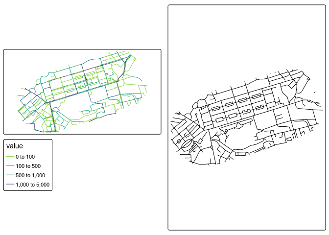
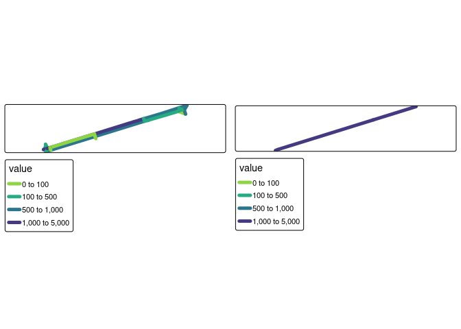

# Prerequisites

The following example requires R and the following packages:

``` r
library(tidyverse)
library(sf)
library(tmap)
```

# Input data

The inputs are as follows:

``` r
input_complex = sf::read_sf("data/rnet_princes_street.geojson")
input_simple = sf::read_sf("data/rnet_pinces_street_simple.geojson")
summary(duplicated(input_complex$geometry))
```

       Mode   FALSE 
    logical    1144 

``` r
summary(duplicated(input_simple$geometry))
```

       Mode   FALSE    TRUE 
    logical     487     487 

The input ‘simple’ centreline data has duplicate geometries. We can
remove those as follows:

``` r
dups = duplicated(input_simple$geometry)
input_simple = input_simple |>
  filter(!dups)
```

``` r
brks = c(0, 100, 500, 1000, 5000)
m1 = tm_shape(input_complex) + tm_lines("value", palette = "viridis", breaks = brks)
m2 = tm_shape(input_simple) + tm_lines()
tmap_arrange(m1, m2, nrow = 1)
```



# Joining the data

``` r
remotes::install_github("ropensci/stplanr")
```

    Using github PAT from envvar GITHUB_PAT

    Skipping install of 'stplanr' from a github remote, the SHA1 (4444c7e0) has not changed since last install.
      Use `force = TRUE` to force installation

``` r
# stplanr::rnet_join
```

The values in the `input_complex` dataset are as follows:

``` r
names(input_complex)
```

    [1] "value"     "Quietness" "length"    "index"     "geometry" 

``` r
summary(input_complex$value)
```

       Min. 1st Qu.  Median    Mean 3rd Qu.    Max. 
        0.0     3.0    88.0   328.4   375.2  3212.0 

To join the network values we will try the `rnet_join` function in
`stplanr`, which has the following arguments:

``` r
args(stplanr::rnet_merge)
```

    function (rnet_x, rnet_y, dist = 5, funs = NULL, sum_flows = TRUE, 
        ...) 
    NULL

``` r
input_simple_id = input_simple |>
  select(identifier)
funs = list(value = sum, Quietness = mean)
sum(sf::st_length(input_simple))
```

    38132.7 [m]

``` r
input_simple_id = stplanr::rnet_subset(input_simple_id, input_complex, dist = 30)
```

    Warning: attribute variables are assumed to be spatially constant throughout
    all geometries

    Warning in st_cast.sf(sf::st_cast(x, "MULTILINESTRING"), "LINESTRING"):
    repeating attributes for all sub-geometries for which they may not be constant

``` r
input_simple_joined = stplanr::rnet_merge(
  input_simple_id[1],
  input_complex[c("value", "Quietness")],
  dist = 30, segment_length = 10, funs = funs
)
```

    Warning: attribute variables are assumed to be spatially constant throughout
    all geometries

    Warning: repeating attributes for all sub-geometries for which they may not be
    constant

    Warning: st_centroid assumes attributes are constant over geometries

    Joining with `by = join_by(identifier)`

``` r
nrow(input_simple_joined)
```

    [1] 456

``` r
nrow(input_simple)
```

    [1] 487

``` r
names(input_simple_joined)
```

    [1] "identifier" "geometry"   "value"      "Quietness"  "length_x"  

We can compare the network lengths as follows:

``` r
sum(sf::st_length(input_simple_id))
```

    34329.99 [m]

``` r
sum(sf::st_length(input_complex))
```

    49264.17 [m]

``` r
summary(duplicated(input_simple_id$geometry))
```

       Mode   FALSE 
    logical     456 

<!-- The overlapping network values are as follows: 
&#10;
::: {.cell}
&#10;```{.r .cell-code}
# tm_shape(input_simple_joined) + tm_fill("value")
```
:::
&#10;
 We can calculate the distance-weighted average of the network values as follows:
&#10;
::: {.cell}
&#10;```{.r .cell-code}
rnetj_summary = input_simple_joined %>%
  sf::st_drop_geometry() %>%
  group_by_at(1) %>%
    summarise(
      mean_flow = weighted.mean(value, length_y, na.rm = TRUE),
      total_flow_m = sum(value * length_y, na.rm = TRUE)
      )
input_simple_joined = left_join(input_simple, rnetj_summary)
input_simple_joined = input_simple_joined |>
  mutate(value = total_flow_m / length)
```
:::
&#10;
The initial result is as follows: -->

There is a small number of segments in the output that have very high
values:

``` r
high_values = input_simple_joined |> arrange(desc(value)) |> head(10)
m_high_values = tm_shape(high_values) + tm_lines("value")
summary(sf::st_length(high_values))
```

       Min. 1st Qu.  Median    Mean 3rd Qu.    Max. 
     0.8057  4.0527  8.3559  9.4874 11.3714 22.8763 

``` r
summary(high_values$value)
```

       Min. 1st Qu.  Median    Mean 3rd Qu.    Max. 
       4347    4931    5295    7608    6905   26002 

We can remove them to avoid skewing the results.

``` r
# sanity check lengths:
# cor(input_complex$length, sf::st_length(input_complex)) # 100%
input_simple_joined = input_simple_joined |>
  filter(length_x > 10)
total_flow_input = round(sum(input_complex$value * sf::st_length(input_complex)) / 1000)
# output:
total_flow_output = round(sum(input_simple_joined$value * as.numeric(sf::st_length((input_simple_joined))), na.rm = TRUE) / 1000)

message("Total flow input: ", total_flow_input, "km")
```

    Total flow input: 17121km

``` r
message("Total flow output: ", total_flow_output, "km")
```

    Total flow output: 17232km

``` r
summary(input_simple_joined$value)
```

       Min. 1st Qu.  Median    Mean 3rd Qu.    Max.    NA's 
        0.0   184.2   413.2   762.7  1068.1  5349.8      58 

``` r
summary(input_complex$value)
```

       Min. 1st Qu.  Median    Mean 3rd Qu.    Max. 
        0.0     3.0    88.0   328.4   375.2  3212.0 

If the distances differ, we can adjust the values of the new network so
that the total distance travelled is the same:

``` r
over_estimate = total_flow_output / total_flow_input
input_simple_joined = input_simple_joined |>
  mutate(value = value / over_estimate)
```

The updated result is as follows:

``` r
m1 = tm_shape(input_complex) + tm_lines("value", palette = "viridis", lwd = 5, breaks = brks)
m2 = tm_shape(input_simple_joined) + tm_lines("value", palette = "viridis", lwd = 5, breaks = brks)
tmap_arrange(m1, m2, nrow = 1)
```

    Warning: Values have found that are higher than the highest break


``` r
nrow(input_simple_joined)
```

    [1] 425

``` r
nrow(input_complex)
```

    [1] 1144

``` r
nrow(input_simple)
```

    [1] 487

``` r
total_flow_output = round(sum(input_simple_joined$value * as.numeric(sf::st_length((input_simple_joined))), na.rm = TRUE) / 1000)
message("Total flow input: ", total_flow_input, "km")
```

    Total flow input: 17121km

``` r
message("Total flow output: ", total_flow_output, "km")
```

    Total flow output: 17121km

We can explore the results interactively as follows:

``` r
tmap_mode("view")
m_combined = m1 + m2
tmap_save(m_combined, "maps/m_combined.html")
browseURL("maps/m_combined.html")
```

# Explanation

To clarify what’s going on, lets do the process only for a couple of
lines, and break the process down into steps.

``` r
input_simple_minimal = input_simple |>
  filter(identifier == "13CF96CE-2A95-451B-B859-E5511B2DEF81" | identifier == "C90C4EA9-5E6A-4A6A-ADEB-5EC5937F6C3A") 
```

The `rnet_join()` function as of July 2023 is as follows:

``` r
rnet_join = function(rnet_x, rnet_y, dist = 5, length_y = TRUE, key_column = 1,
                     subset_x = TRUE, dist_subset = 5, split_y = TRUE, ...) {
  if (subset_x) {
    rnet_x = rnet_subset(rnet_x, rnet_y, dist = dist_subset, ...)
  }
  rnet_x_buffer = geo_buffer(rnet_x, dist = dist, nQuadSegs = 2)
  if (split_y) {
    rnet_y = rnet_split_lines(rnet_y, rnet_x, dist = dist_subset)
  }
  if (length_y) {
    rnet_y$length_y = as.numeric(sf::st_length(rnet_y))
  }
  rnetj = sf::st_join(rnet_x_buffer[key_column], rnet_y, join = sf::st_contains)
  rnetj
}

rnet_subset = function(rnet_x, rnet_y, dist = 1, crop = TRUE, min_x = 3) {
  rnet_x$length_x_original = as.numeric(sf::st_length(rnet_x))
  rnet_y_union = sf::st_union(rnet_y)
  rnet_y_buffer = stplanr::geo_buffer(rnet_y_union, dist = dist, nQuadSegs = 2)
  if(crop) {
    rnet_x = sf::st_intersection(rnet_x, rnet_y_buffer)
    rnet_x = line_cast(rnet_x)
    rnet_x$length_x_cropped = as.numeric(sf::st_length(rnet_x))
    min_length = dist * min_x
    sel_short = rnet_x$length_x_cropped < min_length &
      rnet_x$length_x_original > min_length
    rnet_x = rnet_x[!sel_short, ]
  } else {
    rnet_x[rnet_y_buffer, , op = sf::st_within]
  }
  rnet_x
}
rnet_split_lines = function(rnet_x, rnet_y, dist = 1) {
  if (all(grepl(pattern = "LINE", x = sf::st_geometry_type(rnet_y)))) {
    geo_x = c(
      lwgeom::st_startpoint(rnet_x),
      lwgeom::st_endpoint(rnet_x)
    )
  }
  # speed-up subsequent steps:
  points_x = sf::st_union(geo_x)
  points_buffer_x = stplanr::geo_buffer(points_x, dist = dist)
  rnet_y_split = sf::st_difference(rnet_y, points_buffer_x)
  rnet_y_split_lines = line_cast(rnet_y_split)
  rnet_split_lines$length_osm_cast = as.numeric(sf::st_length(rnet_split_lines))
  # rnet_split_lines[rnet_split_lines$length_osm_cast > min_lenth, ]
  rnet_split_lines
}
line_cast = function(x) {
  sf::st_cast(sf::st_cast(x, "MULTILINESTRING"), "LINESTRING")
}
```

Let’s run these lines line-by-line, starting by creating `rnet_x` and
`rnet_y` objects:

``` r
library(stplanr)
```


    Attaching package: 'stplanr'

    The following objects are masked _by_ '.GlobalEnv':

        line_cast, rnet_join, rnet_subset

``` r
dist = 30
rnet_x = input_simple_minimal
rnet_x_buffer = geo_buffer(rnet_x, dist = dist, nQuadSegs = 2)
rnet_y = input_complex[rnet_x_buffer, , op = sf::st_within]
tm_shape(rnet_x_buffer) + tm_fill("identifier") + tm_shape(rnet_y) + tm_lines()
```

    Some legend labels were too wide. These labels have been resized to 0.66. Increase legend.width (argument of tm_layout) to make the legend wider and therefore the labels larger.


An optional next step is to split the lines:

``` r
remotes::install_github("r-spatial/qgisprocess")
```

    Using github PAT from envvar GITHUB_PAT

    Skipping install of 'qgisprocess' from a github remote, the SHA1 (671863ab) has not changed since last install.
      Use `force = TRUE` to force installation

``` r
library(qgisprocess)
```

    Attempting to load the package cache ...

    Success!

    QGIS version: 3.28.9-Firenze
    Having access to 653 algorithms from 5 QGIS processing providers.
    Run `qgis_configure(use_cached_data = TRUE)` to reload cache and get more details.

``` r
args(qgis_run_algorithm)
```

    function (algorithm, ..., PROJECT_PATH = NULL, ELLIPSOID = NULL, 
        .raw_json_input = NULL, .quiet = TRUE) 
    NULL

``` r
rnet_y_rebuilt = qgis_run_algorithm(
  algorithm = "grass7:v.build.polylines",
  input = rnet_y,
  # Output sf: 
)
```

    Using `cats = "no"`

    Using `type = "line"`

    Using `output = qgis_tmp_vector()`

    Argument `GRASS_REGION_PARAMETER` is unspecified (using QGIS default value).

    Argument `GRASS_SNAP_TOLERANCE_PARAMETER` is unspecified (using QGIS default value).

    Argument `GRASS_MIN_AREA_PARAMETER` is unspecified (using QGIS default value).

    Using `GRASS_OUTPUT_TYPE_PARAMETER = "auto"`

    Argument `GRASS_VECTOR_DSCO` is unspecified (using QGIS default value).

    Argument `GRASS_VECTOR_LCO` is unspecified (using QGIS default value).

    Argument `GRASS_VECTOR_EXPORT_NOCAT` is unspecified (using QGIS default value).

    Problem with OTB installation: OTB folder is not set.

    Problem with SAGA installation: unsupported SAGA version (found: 8.2.2, required: 2.3.).

    ERROR: Unable to create table: 'create table vector_64dc15ceaf3d82 (cat integer, value double precision, Quietness double precision, length double precision, index integer)'

    WARNING: Unable to open vector map <vector_64dc15ceaf3d82@PERMANENT> on level 2. Try to rebuild vector topology with v.build.
    ERROR: Unable to open vector map <vector_64dc15ceaf3d82>

    ERROR: Vector map <output5714dedab1214ae0b0f5af57d268dc3f> not found
    ERROR: Vector map <output5714dedab1214ae0b0f5af57d268dc3f> not found

``` r
rnet_y_split = output = qgis_run_algorithm(
  algorithm = "grass7:v.split",
  input = rnet_y |> select(-index) |> sf::st_transform("EPSG:27700"),
  length = 10
) |>
  sf::st_as_sf()
```

    Using `units = "map"`

    Argument `vertices` is unspecified (using QGIS default value).

    Argument `-n` is unspecified (using QGIS default value).

    Argument `-f` is unspecified (using QGIS default value).

    Using `output = qgis_tmp_vector()`

    Argument `GRASS_REGION_PARAMETER` is unspecified (using QGIS default value).

    Argument `GRASS_SNAP_TOLERANCE_PARAMETER` is unspecified (using QGIS default value).

    Argument `GRASS_MIN_AREA_PARAMETER` is unspecified (using QGIS default value).

    Using `GRASS_OUTPUT_TYPE_PARAMETER = "auto"`

    Argument `GRASS_VECTOR_DSCO` is unspecified (using QGIS default value).

    Argument `GRASS_VECTOR_LCO` is unspecified (using QGIS default value).

    Argument `GRASS_VECTOR_EXPORT_NOCAT` is unspecified (using QGIS default value).

    Problem with OTB installation: OTB folder is not set.

    Problem with SAGA installation: unsupported SAGA version (found: 8.2.2, required: 2.3.).

    Using non-preferred coordinate operation between EPSG:27700 and EPSG:4326. Using +proj=pipeline +step +inv +proj=tmerc +lat_0=49 +lon_0=-2 +k=0.9996012717 +x_0=400000 +y_0=-100000 +ellps=airy +step +proj=push +v_3 +step +proj=cart +ellps=airy +step +proj=helmert +x=446.448 +y=-125.157 +z=542.06 +rx=0.15 +ry=0.247 +rz=0.842 +s=-20.489 +convention=position_vector +step +inv +proj=cart +ellps=WGS84 +step +proj=pop +v_3 +step +proj=unitconvert +xy_in=rad +xy_out=deg, preferred +proj=pipeline +step +inv +proj=tmerc +lat_0=49 +lon_0=-2 +k=0.9996012717 +x_0=400000 +y_0=-100000 +ellps=airy +step +proj=hgridshift +grids=uk_os_OSTN15_NTv2_OSGBtoETRS.tif +step +proj=unitconvert +xy_in=rad +xy_out=deg.

``` r
rnet_y_split = rnet_y_split |> sf::st_transform("EPSG:4326")
rnet_y_split$length_split = as.numeric(sf::st_length(rnet_y_split))
```

The resulting `rnet_y_split` object is as follows:

``` r
rnet_y_split
```

    Simple feature collection with 175 features and 5 fields
    Geometry type: LINESTRING
    Dimension:     XY
    Bounding box:  xmin: -3.20607 ymin: 55.95036 xmax: -3.19669 ymax: 55.95206
    Geodetic CRS:  WGS 84
    # A tibble: 175 × 6
         cat value Quietness length                                geom length_split
     * <int> <dbl>     <dbl>  <dbl>                    <LINESTRING [°]>        <dbl>
     1     1     0        50  10.6  (-3.20565 55.95051, -3.20564 55.95…         5.28
     2     1     0        50  10.6  (-3.205632 55.95046, -3.20562 55.9…         5.28
     3     2     0        40   9.52 (-3.2027 55.95092, -3.20266 55.950…         9.51
     4     3     3        95  32.6  (-3.19727 55.95184, -3.197147 55.9…         8.12
     5     3     3        95  32.6  (-3.197147 55.95182, -3.19706 55.9…         8.12
     6     3     3        95  32.6  (-3.197024 55.95179, -3.196902 55.…         8.12
     7     3     3        95  32.6  (-3.196902 55.95177, -3.19678 55.9…         8.12
     8     4    32        50  88.1  (-3.20409 55.95078, -3.20394 55.95…         9.76
     9     4    32        50  88.1  (-3.20394 55.95081, -3.20379 55.95…         9.76
    10     4    32        50  88.1  (-3.20379 55.95083, -3.20364 55.95…         9.76
    # ℹ 165 more rows

``` r
rnet_y
```

    Simple feature collection with 26 features and 4 fields
    Geometry type: LINESTRING
    Dimension:     XY
    Bounding box:  xmin: -3.20607 ymin: 55.95036 xmax: -3.19669 ymax: 55.95206
    Geodetic CRS:  WGS 84
    # A tibble: 26 × 5
       value Quietness length index                                         geometry
       <dbl>     <dbl>  <dbl> <int>                                 <LINESTRING [°]>
     1     0        50  10.6      8 (-3.20565 55.95051, -3.20564 55.95048, -3.20562…
     2     0        40   9.52   107 (-3.2027 55.95092, -3.20266 55.95086, -3.20266 …
     3     3        95  32.6    206 (-3.19727 55.95184, -3.19706 55.9518, -3.19678 …
     4    32        50  88.1    403           (-3.20409 55.95078, -3.20274 55.95101)
     5    32        40  10.4    406 (-3.20274 55.95101, -3.20273 55.95098, -3.2027 …
     6    36        50 102.     413           (-3.20565 55.95051, -3.20409 55.95078)
     7   122        50  10.3    631 (-3.19717 55.95191, -3.19709 55.95193, -3.19707…
     8   122        50   6.96   632 (-3.1972 55.95197, -3.19719 55.95194, -3.19717 …
     9   147        60  15.1    709 (-3.20592 55.95036, -3.20585 55.95041, -3.20583…
    10   147        60  18.1    710 (-3.20594 55.95063, -3.20589 55.95058, -3.20585…
    # ℹ 16 more rows

``` r
m1 = tm_shape(rnet_y) + tm_lines()
m2 = tm_shape(rnet_y_split) + tm_lines()
tmap_arrange(m1, m2, nrow = 1)
```


The next stage is to join the two datasets, speeding things up by taking
the centroid of the split lines:

``` r
rnet_y_centroids = rnet_y_split |> sf::st_centroid()
```

    Warning: st_centroid assumes attributes are constant over geometries

``` r
rnetj = sf::st_join(rnet_x_buffer["identifier"], rnet_y_centroids)
```

We then take the distance-weighted average of the values:

``` r
rnetj_summary = rnetj %>%
  sf::st_drop_geometry() %>%
  group_by_at(1) %>%
    summarise(
      total_flow_m = sum(value * length_split, na.rm = TRUE)
      )
input_simple_joined = left_join(rnet_x, rnetj_summary)
```

    Joining with `by = join_by(identifier)`

``` r
input_simple_joined = input_simple_joined |>
  mutate(value = total_flow_m / length)
input_simple_joined["value"]
```

    Simple feature collection with 2 features and 1 field
    Geometry type: MULTILINESTRING
    Dimension:     XY
    Bounding box:  xmin: -3.205913 ymin: 55.95041 xmax: -3.196692 ymax: 55.95202
    Geodetic CRS:  WGS 84
    # A tibble: 2 × 2
      value                                                                 geometry
      <dbl>                                                    <MULTILINESTRING [°]>
    1 2533. ((-3.205913 55.95041, -3.205829 55.95043, -3.205745 55.95045, -3.202624…
    2 1647. ((-3.199503 55.95153, -3.198098 55.95178, -3.197342 55.95191, -3.196692…

We can plot the before/after results as follows:

``` r
m1 = tm_shape(rnet_y) + tm_lines("value", palette = "viridis", lwd = 5, breaks = brks)
m2 = tm_shape(input_simple_joined) + tm_lines("value", palette = "viridis", lwd = 5, breaks = brks)
tmap_arrange(m1, m2, nrow = 1)
```



``` r
m = tm_shape(input_simple_minimal) + tm_lines(lwd = 5) +
  qtm(input_simple)
tmap_save(m, "maps/m_explanation.html")
```

    Interactive map saved to maps/m_explanation.html

``` r
# browseURL("maps/m_explanation.html")
```
