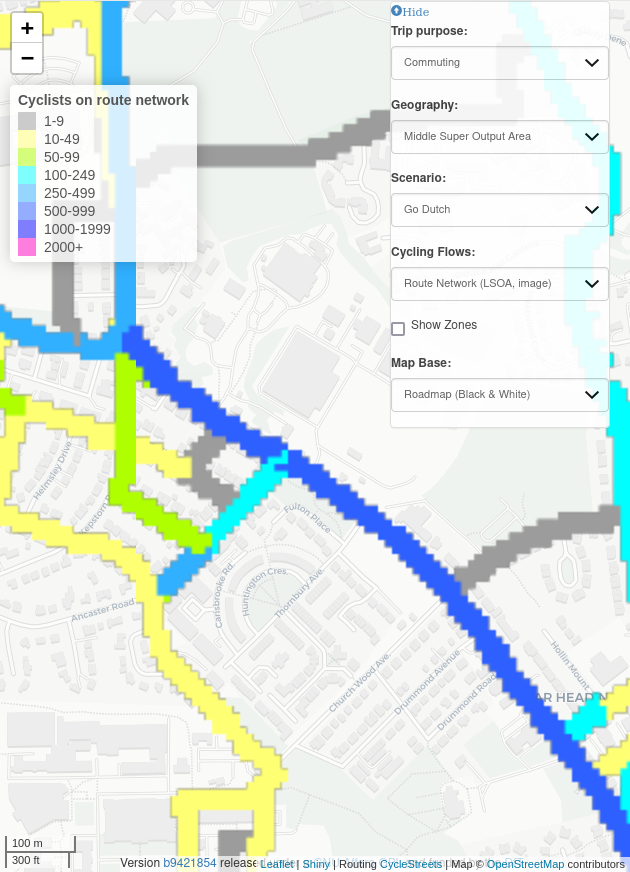

# Network simplification: application to the visualisation of transport
networks

# Reproducibility

To reproduce this paper you need `quarto` installed and the Elsevier
extension which can be installed as follows:

``` bash
quarto add quarto-journals/elsevier
```

To write the paper we recommend using the Quarto extension for VS Code.
You can go into the visual editor with the following shortcut:

    Ctrl+Shift+F4

You can then add citations and other elements of academic writing.

# Abstract

# Introduction

Datasets representing route networks are central to transport planning.
Unlike other key types of data used in transport planning, route
networks are both a key input *and* key output. Origin-destination, GPS,
and remote sensing imagery datasets are all key inputs but rarely
feature as outputs of transport models. Global and local estimates of
costs and benefits associated with changes to transport systems,
geographic outputs at regional, local and corridor level, and
visualisation of agents on the system are common outputs. However, route
network datasets are ubiquitous as both transport model inputs
(typically representing road networks) outputs (typically with model
outputs such as flow per time of day).[^1]

This raises the question, what are transport network datasets? The
intuitive definition is that route network datasets are digital
representations of footpaths, cycleways, highways and other ways along
which people and goods can travel. More formally, transport network
datasets must contain, at a minimum, geographic information on the
coordinates of vertices (points along ways) and edges (the straight
lines between vertices representing ways). Usually they also contain
attributes associated with these ways. File formats for representing
them include Transportation Network Test Problem (TNTP and stored as a
series of `.tntp` plain text files, examples of which can be found in
[github.com/bstabler/TransportationNetworks](https://github.com/bstabler/TransportationNetworks)),
`.DAT` files used by the proprietary SATURN transport modelling system
and XML-based `.osm` or `.pbf` files that encode OpenStreetMap data.

A more recent approach is to represent transport networks in standard
geographic file formats. In this approach, used in the present paper,
transport networks are represented as a series of non-overlapping
linestrings, with attributes such as way type and flow. Making transport
datasets compliant with the ‘simple features’ geographic data
specification in this way has many advantages compared with the
proliferation of formats used by proprietary software, enabling more
easier sharing of datasets between people and programs. The simple
features standard is formalised by the International Organization for
Standardization in [ISO
19125-1:2004](https://www.iso.org/standard/40114.html) and implemented
in a wide range of file formats such as ESRIs shapefile, GeoJSON, and
the open standard for geographic data, GeoPackage. For ease of data
sharing, we share transport networks used in this paper as plain text
GeoJSON files.

Much research has focussed on generating and modelling transport network
datasets. This is unsurprising given the importance of transport
networks as inputs and outputs of transport models. Much has been
written about network ‘cleaning’ and simplification as a pre-processing
step in transport modelling.
<!-- Todo: add papers on network cleaning and simplification. -->
However, there has been relatively little research into transport
network visualisation, despite the importance of visualisation to enable
more people to understand transport models, for informing policies and
prioritising investment in transport planning.

Morgan and Lovelace (2020) presented methods for combining multiple
overlapping routes into a single route network with non-overlapping
linestrings for visualisation, implemented in the function `overline()`.
The approach takes overlapping linestrings representing multiple routes
and combines them into a single network with non-overlapping
linestrings. The approach has been used to visualise large transport
networks, informing investment decisions in transport planning
internationally. However, the ‘overline’ approach, without further
processing, has limitations:

- It does not remove redundant vertices, which can lead to large file
  sizes and slow rendering.
- It does not remove redundant edges, which can lead to visual
  artefacts.
- Parallel ways that are part of the same corridor are not merged into a
  single way, resulting in outputs that are difficult to interpret.

The final point is most relevant to the present paper. An example of the
issue is shown in [Figure 1](#fig-pct) from the Propensity to Cycle Tool
for England (PCT), with segment values representing daily commuter
cycling potential flows (Lovelace et al. 2017). The left panel shows
Otley Road with a flow value of 818 ([Figure 1 (a)](#fig-otley-road)).
The right panel, by contrast, shows three parallel ways parallel to
Armley Road with flow values of 515 (shown), 288 and 47 (values not
shown) ([Figure 1 (b)](#fig-armley-road)). Although this section of
Armley road has a higher cycling potential than the section of Otley
Road shown (515 + 288 + 47 \> 818), this is not clear from the
visualisation.

<div id="fig-pct">

<table>
<colgroup>
<col style="width: 50%" />
<col style="width: 50%" />
</colgroup>
<tbody>
<tr class="odd">
<td style="text-align: center;"><div width="50.0%"
data-layout-align="center">
<p></p>
</div></td>
<td style="text-align: center;"><div width="50.0%"
data-layout-align="center">
<p></p>
</div></td>
</tr>
</tbody>
</table>

Figure 1: Illustration of issues associated with route network-level
results containing multiple parallel ways on the same corridor: it is
not clear from the visualisation that the corridor shown in the right
hand figure has greater flow than the corridor shown in the left.
Source: open access Propensity to Cycle Tool results available at
www.pct.bike.

</div>

A subsequent step described in the paper is to post-process the
geographic representation of the transport network into a raster image,
which can be used to visualise the network. The ‘rasterisation’ stage
can tackle some of the issues associated with multiple parallel ways,
but introduces new issues, as shown in [Figure 2](#fig-rasterisation).

<div id="fig-rasterisation">

<table>
<colgroup>
<col style="width: 50%" />
<col style="width: 50%" />
</colgroup>
<tbody>
<tr class="odd">
<td style="text-align: center;"><div width="50.0%"
data-layout-align="center">
<p></p>
</div></td>
<td style="text-align: center;"><div width="50.0%"
data-layout-align="center">
<p></p>
</div></td>
</tr>
</tbody>
</table>

Figure 2: Rasterised network results for the same corridors shown in
[Figure 1](#fig-pct). Note the visual artefacts such as ‘staircase’
effects and overlapping values resulting from parallel lines along
Armley Road (right panel). Source: open access Propensity to Cycle Tool
results available at www.pct.bike.

</div>

The aim of this paper is to outline approaches for visualising transport
networks that address the issues associated with multiple parallel ways.
Furthermore we present solutions, implemented with open source software
for reproducible and scalable results, to support better visualisation
of transport networks for more evidence-based and sustainable transport
planning.

[Section 3](#sec-methods) describes the input datasets and methods used
to generate the results presented in this paper.
[Section 4](#sec-results) presents the results, illustrated by network
maps of the example datasets. Finally, [Section 5](#sec-discussion)
discusses the results and outlines future work.

# Data

# Methods

Two fundamental approaches to simplifying transport networks are:

- Simplifying the geometry of the network, by removing redundant
  vertices and edges and/or by merging parallel ways and *then* merging
  the attributes of the original network onto the simplified network.
- Iteratively removing edges and updating the attributes of the
  remaining edges by routing through the network.

In this paper we will focus on the former approach, which assumes that a
simplified geographic representation of the network is available.

## Geometry simplification

A prerequisite of simple networks is simple geometries.

### Topology-preserving simplification

Topology-preserving simplification reduces the number of vertices in a
linestring while preserving the topology of the network. As shown in the
figures below, it can merge lines that are parallel, but does not work
for complex geometries.

<div id="fig-topology-preserving">

<table>
<colgroup>
<col style="width: 100%" />
</colgroup>
<tbody>
<tr class="odd">
<td style="text-align: center;"><div width="100.0%"
data-layout-align="center">
<p></p>
</div></td>
</tr>
</tbody>
</table>

<table>
<colgroup>
<col style="width: 100%" />
</colgroup>
<tbody>
<tr class="odd">
<td style="text-align: center;"><div width="100.0%"
data-layout-align="center">
<p></p>
</div></td>
</tr>
</tbody>
</table>

Figure 3: Illustration of topology-preserving simplification, using the
`mapshaper` JavaScript package. The % values represent the “percentage
of removable points to retain” argument values used in the
simplification process.

</div>

The graphic below shows a 2 panel plot showing simplification with the
`consolidate_intersections` function from the `osmnx` Python package.

<div id="fig-osmnx-consolidate-intersections">

<table>
<colgroup>
<col style="width: 50%" />
<col style="width: 50%" />
</colgroup>
<tbody>
<tr class="odd">
<td style="text-align: center;"><div width="50.0%"
data-layout-align="center">
<p></p>
</div></td>
<td style="text-align: center;"><div width="50.0%"
data-layout-align="center">
<p></p>
</div></td>
</tr>
</tbody>
</table>

Figure 4: Illustration of consolidation of intersections, with the
`consolidate_intersections` function from the `osmnx` Python package.

</div>

### Simplification with parallel edge removal

A more aggressive approach is to simplify and alter network topology in
a single step, “through the removal of duplicate or parallel edges, and
combining simply-connected nodes” (Deakin 2023).

<!-- TODO: Section on network simplification by iterative edge removal and re-routing -->
<!-- ## Network simplification by iterative edge removal and re-routing -->

## Merging simple and detailed networks

After you have a simplified version of the network, from any source, the
next step is merging the attributes.

### Data Preparation and Processing

The methodology employed in this study is designed to process, analyse,
and merge detailed spatial data with cycle commuting information,
focusing on a simplified road network. By reducing redundancy and
intricacies in the data, this approach aims to provide a more intuitive
understanding of cycling patterns and behaviors.

The process is divided into several stages, each with a specific
purpose, collectively contributing to the creation of a streamlined
representation of the road network that emphasises essential
cycling-related information.

The process requires two main input datasets. The first is a GeoJSON
file named “rnet_princes_street.geojson,” read into the system as
input_detailed. This dataset represents the more intricate and detailed
spatial information related to cycle commuting (stored in
input_detailed\[‘value’\]). The second is another GeoJSON file named
“Edc_Roadlink.geojson,” read as input_simple, serving as the simplified
road network onto which the detailed information will be projected.

#### The process is structured into specific stages:

##### Preprocessing on input_detailed:

###### 1. Preprocessing on input_detailed

The preprocessing stage focuses on cleaning and restructuring the
input_detailed data to set a unique index for each road. It involves
merging spatially connected lines within the dataset, grouped by ‘Value’
and ‘Quietness’ attributes. A custom function, merge_directly_connected,
is implemented for this purpose. The function uses a while loop that
continuously joins lines if the start and end coordinates match,
resulting in a set of merged lines. The purpose of this action is to
eliminate redundancy and ensure that each road segment has a unique
identifier, facilitating further analysis.

###### 2. Segmentation of input_detailed

After preprocessing, the processed input_detailed data is then segmented
using the split_line_at_angles function. This function computes the
direction of each vector within a line and identifies indices where the
angle between consecutive vectors exceeds a given threshold. The line is
then split at these points into individual segments. The purpose of this
action is to ensure that the following geospatial data analysis can
produce more refined results by recognising and preserving significant
changes in direction.

Together, these stages transform the detailed spatial data into a format
suitable for merging with the simplified road network.

##### Projecting cycle commuting data from input_detailed to input_simple

The process of projecting cycle commuting data from the more detailed
spatial information (input_detailed) to a simplified road network
(input_simple) is carried out through a series of well-defined stages:

###### 1. Creating a Buffer around input_simple

A new GeoDataFrame gdf_buffer is created around the geometries in
input_simple using a predefined buffer size. This buffer serves as a
zone within which lines from input_detailed will be analyzed and matched
to the corresponding roads in input_simple.

###### 2. Identifying Lines within the Buffer and Processing ‘value’ Attribute

The first major step in this stage is to find the lines from
input_detailed that fall within the buffer. The ‘value’ attribute
associated with these lines is then processed according to three
specific requirements:

Requirement 1: If multiple lines with the same ‘Ori_index’ are within
the same buffer, the mean ‘value’ of these lines is added to the buffer.

Requirement 2: If lines with the same ‘Ori_index’ are within different
buffers, the lengths of the lines are compared, and the ‘value’ is added
to the buffer with the longer lines.

Requirement 3: The ‘value’ of each line is added only once to ensure
accuracy.

In this section, instead of using standard geopandas functions like
gpd.sjoin, the code implements a series of loops and dictionary
structures. This custom approach meets the specific requirements,
storing the index of lines within the buffer in
gdf_buffered\[‘Line_index_from_gdf_Within’\] and ensuring that each
‘value’ is added only once.

###### 3. Identifying Lines that Intersect with the Buffer

Lines from input_detailed that intersect with the buffer are also
identified. This stage involves calculating the angle between
intersecting lines and the corresponding lines in input_simple. The
functions get_vector and calculate_angle are utilised to compute the
vectors and angles, respectively.

If the angle is less than 25 degrees, the intersecting lines are
considered to be in the same direction as the corresponding line in
input_simple, and their ‘value’ is added to the attribute
gdf_buffered\[‘value_sum’\]. The index of intersecting lines is recorded
in gdf_buffered\[‘Line_index_from_gdf_Intersect’\].

###### 4. Final Data Aggregation

In the final stage of the process, the attributes from gdf_buffered are
matched to input_simple using the index. A join operation then updates
input_simple with the attributes value_sum, effectively merging the
processed cycle commuting data onto the simplified road network.

<!-- TODO: add content to this section. -->

# Results

# Discussion

# References

<!-- Tests -->

<div id="refs" class="references csl-bib-body hanging-indent">

<div id="ref-deakin2023" class="csl-entry">

Deakin, Will. 2023. *Transport Network Simplification Through Network
Disaggregation and Reassembly of OpenStreet Map (OSM) Networks*.
<https://github.com/anisotropi4/graph>.

</div>

<div id="ref-lovelace2017" class="csl-entry">

Lovelace, Robin, Anna Goodman, Rachel Aldred, Nikolai Berkoff, Ali
Abbas, and James Woodcock. 2017. “The Propensity to Cycle Tool: An Open
Source Online System for Sustainable Transport Planning.” *Journal of
Transport and Land Use* 10 (1). <https://doi.org/10.5198/jtlu.2016.862>.

</div>

<div id="ref-morgan2020" class="csl-entry">

Morgan, Malcolm, and Robin Lovelace. 2020. “Travel Flow Aggregation:
Nationally Scalable Methods for Interactive and Online Visualisation of
Transport Behaviour at the Road Network Level.” *Environment & Planning
B: Planning & Design*, July. <https://doi.org/10.1177/2399808320942779>.

</div>

</div>

[^1]: See the [online
    documentation](https://sumo.dlr.de/docs/Simulation/Output/index.html)
    of the SUMO traffic simulation tool for an example of the wide range
    of data formats that transport datasets can output.
